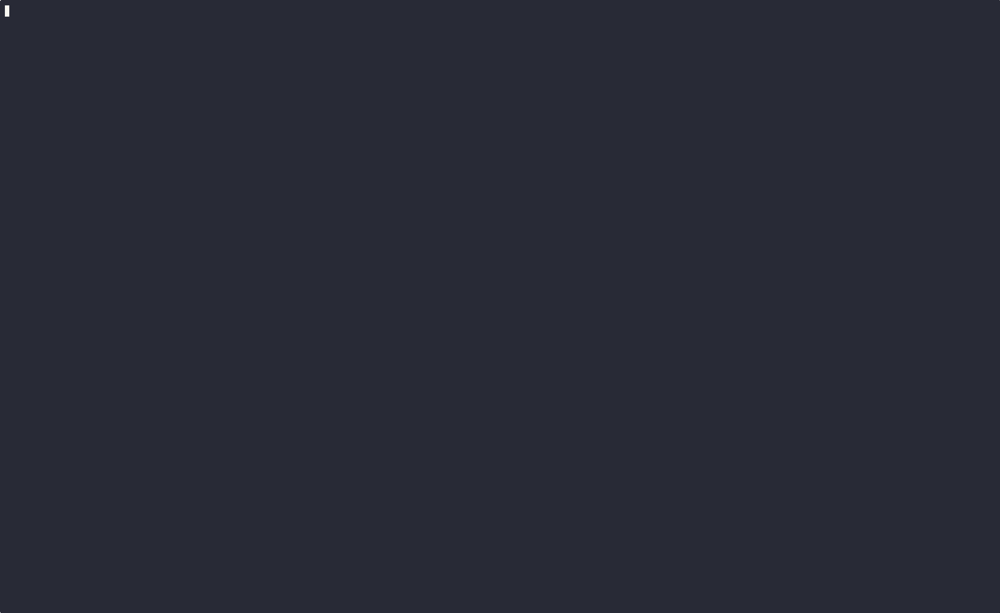

# Cover Letter Maker

<!-- Add a short GIF demo below -->


A CLI tool that uses Google Generative AI + LangChain to generate personalized cover letters from your CV and a job listing. Generates a LaTeX-formatted letter and can compile to PDF (if pdflatex is available).

Features
- Generate structured cover letters (JSON + rendered LaTeX)
- Paste or upload CV (PDF extraction via docling)
- Save reusable CV and custom instructions
- Preview and export as PDF (requires a local LaTeX installation)

[](https://asciinema.org/a/753294)

Prerequisites
- Python 3.12+
- A Google Generative AI API key (set as GOOGLE_API_KEY)
- Optional: pdflatex (for PDF export)
- Optional: system dependencies for docling PDF extraction (see docling docs)

Quick install
1. Clone the repo and enter the project folder:
   - `git clone <repo-url>`
   - `cd cover_letter_maker`

2. Create a virtual environment and activate it (Better to use uv):
   - `python -m venv .venv`
   - On macOS / Linux: `source .venv/bin/activate`
   - On Windows (PowerShell): `.venv\Scripts\Activate.ps1`

3. Install the package and dependencies:
   - `pip install -r requirements.txt`

4. Copy environment example and set your API key:
   - `cp .env.example .env`
   - Edit `.env` and set `GOOGLE_API_KEY=YOUR_GOOGLE_API_KEY`
   - Or export in your shell: `export GOOGLE_API_KEY="your_key"`

Run the CLI
- From the project directory:
  - `python cli_tool.py`

Workflow overview
1. Start the CLI and choose how to provide your CV:
   - Paste plain text, upload a PDF (docling extraction), or reuse saved CV.
2. Paste the job listing text.
3. Optionally add a custom instruction (tone, focus, length).
4. Generate the cover letter — the AI returns structured JSON which is shown in the preview.
5. Export: saves a LaTeX file under ./cover_letters and attempts to compile to PDF if pdflatex is present.

Files & storage
- Saved CV and custom instruction are stored in: ~/.cover_letter_generator/
- Generated LaTeX and PDFs are saved in: ./cover_letters/
- Example JSON export when generating from the template: cover_letter_data.json

Troubleshooting
- GOOGLE_API_KEY not set: the tool will not call the AI. Set the env var or .env.
- pdflatex not found: PDF export will be skipped. Install a TeX distribution.

```sh
# Debian/Ubuntu — update and install required TeX Live packages (combined)
sudo apt-get update && sudo apt-get install -y texlive-latex-base texlive-latex-extra texlive-fonts-extra texlive-fonts-recommended
```

Other platforms:
- macOS: MacTeX (or via Homebrew): brew install --cask mactex
- Windows: MiKTeX

- PDF extraction issues: docling may require additional system libs — see docling documentation.

Security & privacy
- The tool sends CV/job listing text to the Google Generative API — avoid sending sensitive personal data you cannot share.
- API keys are read from environment variables or .env; keep them secret.

Extending & development
- Core modules:
  - cli_tool.py — CLI interface
  - template.py — LaTeX template and PDF compilation
  - prompt.py — prompt template used to generate structured output
- To modify the LaTeX template or escaping rules, edit template.py.
- To adjust the prompt or JSON schema, edit prompt.py.

Contributing
Contributions are open to anyone — we welcome bug reports, feature requests, documentation improvements, and pull requests.

special thanks to [@aboodAJ](https://github.com/aboodAJ/cover-letter-maker) for the initial inspiration